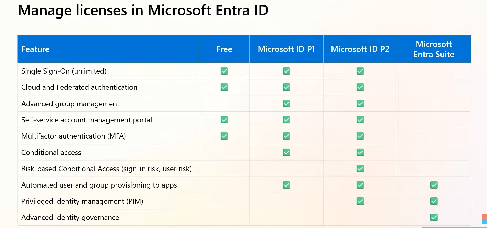
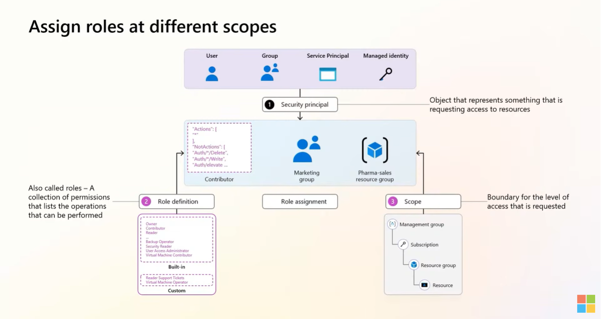
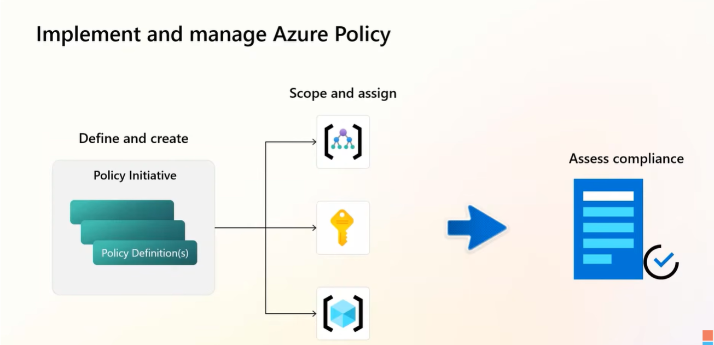
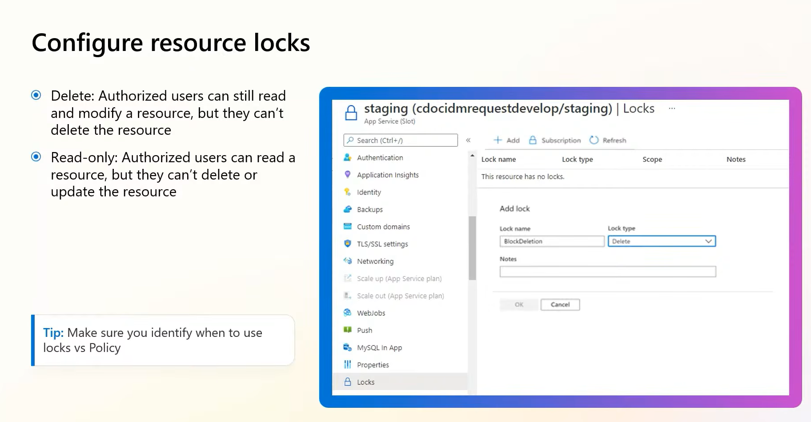
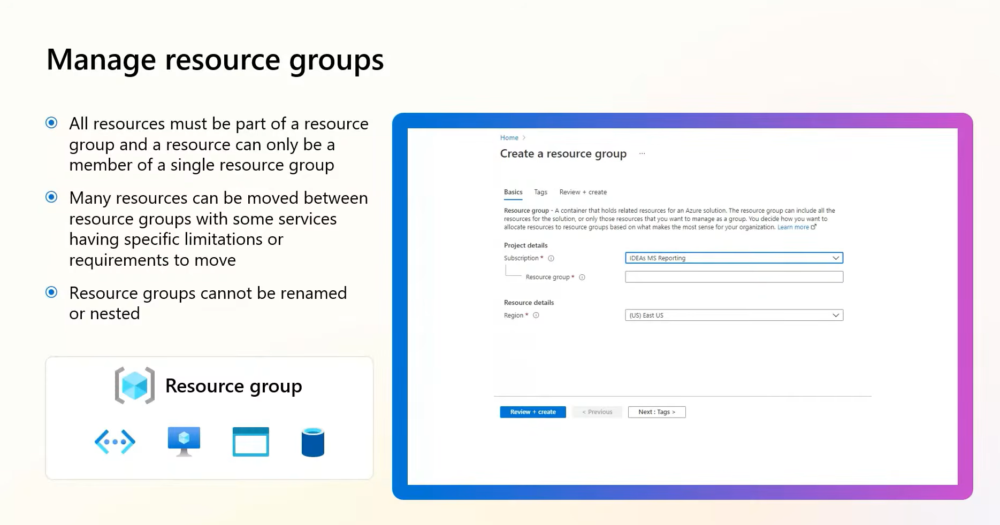
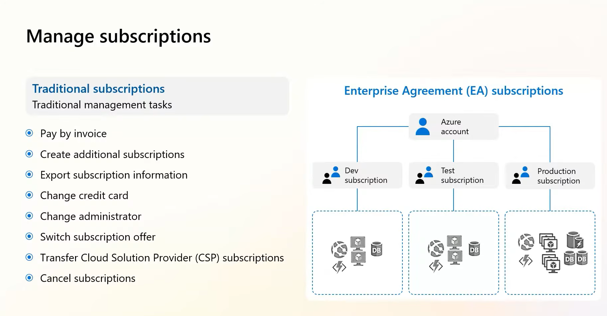
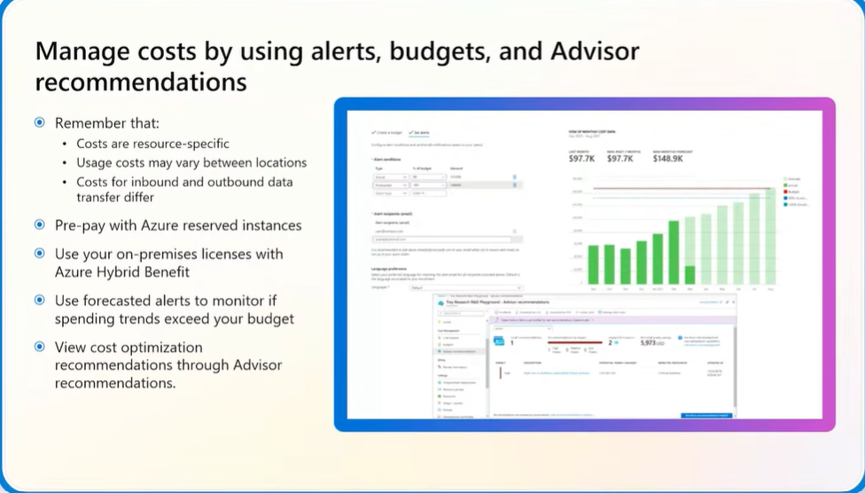
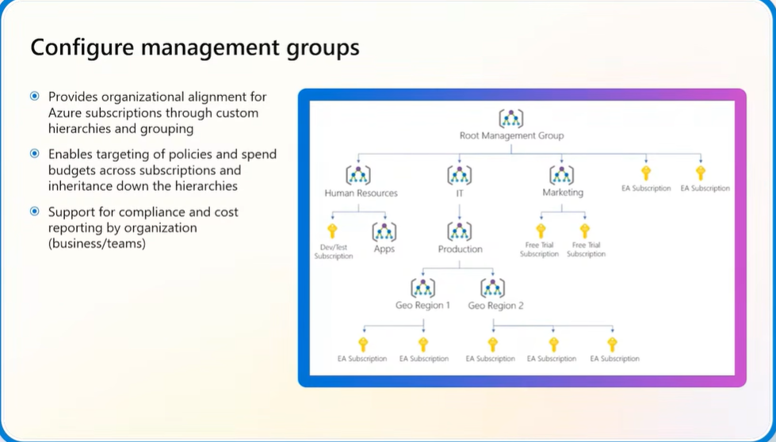

# 1. Manage Azure Identities and Governance (20–25%)

> Status: 🔴 Not started | 🟡 In progress | 🟢 Done
> Last updated: <!-- date -->

---

## 1.1 Manage Microsoft Entra Users and Groups

### Create users and groups
- Notes:

### Manage user and group properties
- Notes:

### Manage licenses in Microsoft Entra ID
- Notes:

Key Notes 
### Manage external users
- Notes:

### Configure self-service password reset (SSPR)
- Notes:

---

## 1.2 Manage Access to Azure Resources

### Manage built-in Azure roles
- Notes:

### Assign roles at different scopes
- Notes:

### Interpret access assignments
- Notes:

---

## 1.3 Manage Azure Subscriptions and Governance

### Implement and manage Azure Policy
- Notes:

### Configure resource locks
- Notes:

### Apply and manage tags on resources
- Notes:

### Manage resource groups
- Notes:

### Manage subscriptions
- Notes:

### Manage costs by using alerts, budgets, and Azure Advisor recommendations
- Notes:

### Configure management groups
- Notes:

---

## 🔑 Key Takeaways
-

## ❓ Questions / Gaps to Revisit
-

## 🔗 Useful Links
-
