# 2. Implement and Manage Storage (15–20%)

> Status: 🔴 Not started | 🟡 In progress | 🟢 Done
> Last updated: <!-- date -->

---

## 2.1 Configure Access to Storage

### Configure Azure Storage firewalls and virtual networks
- Notes:
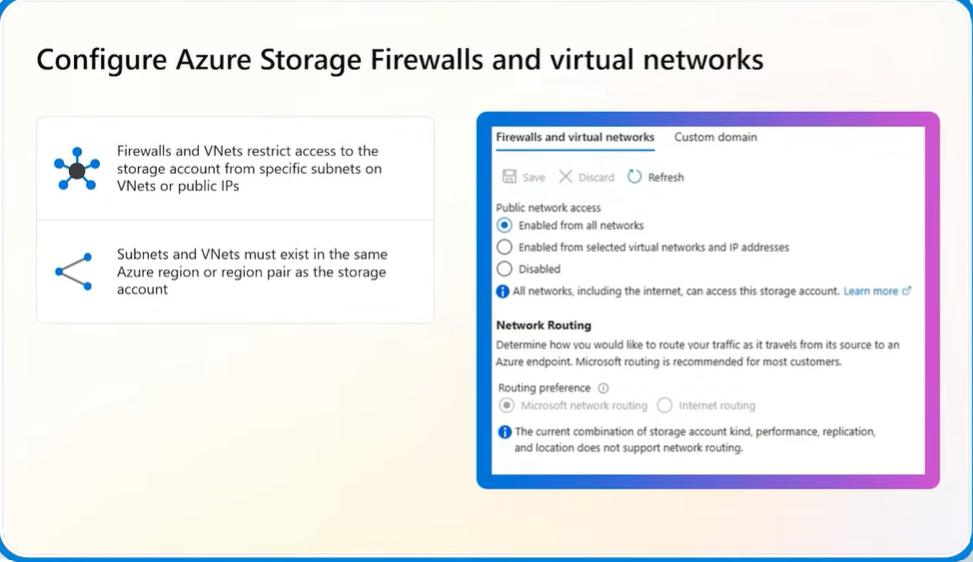
### Create and use shared access signature (SAS) tokens
- Notes:
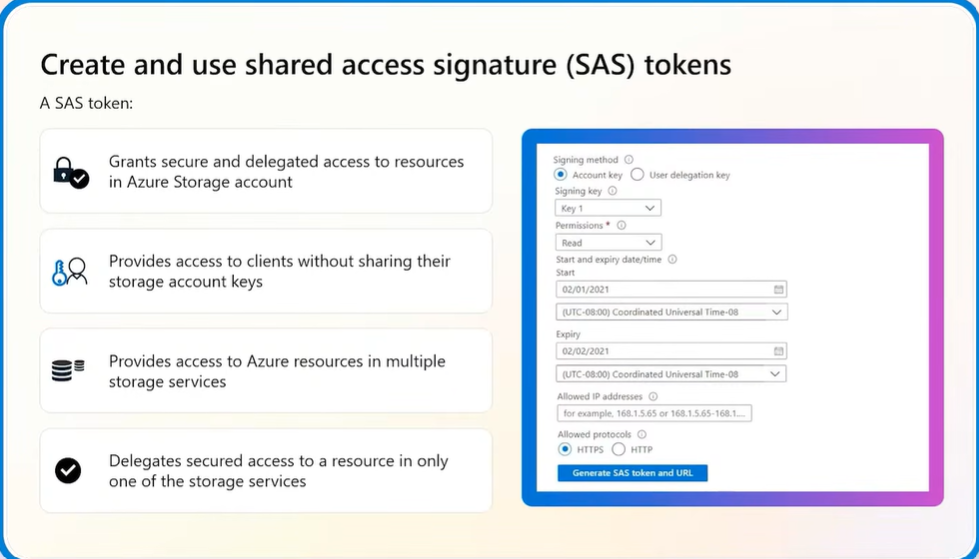

### Configure stored access policies
- Notes:
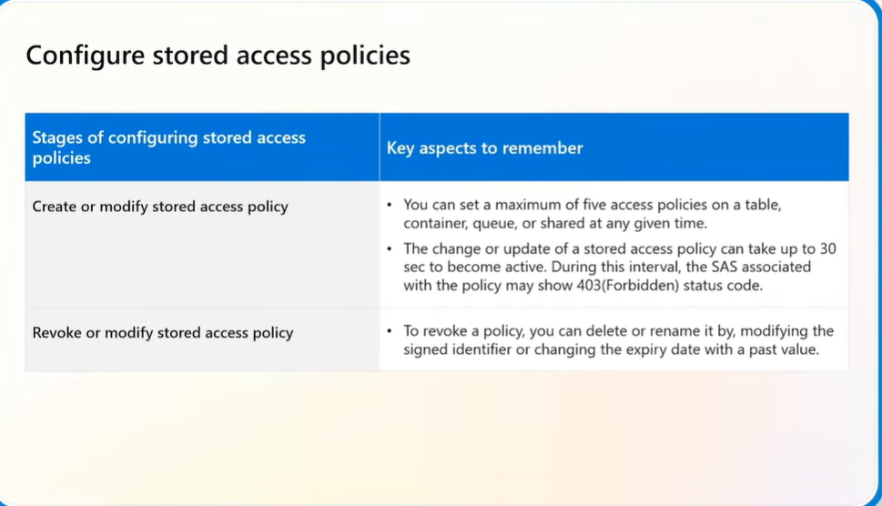

### Manage access keys
- Notes:
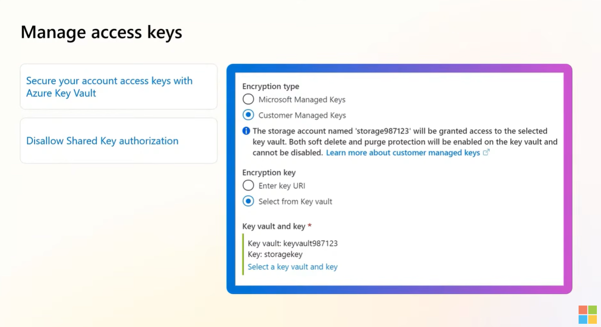
### Configure identity-based access for Azure Files
- Notes:
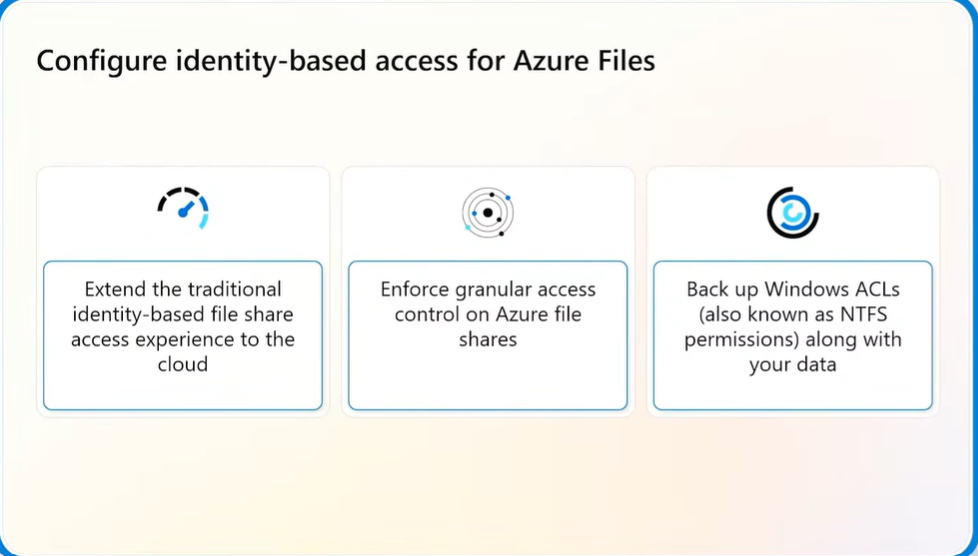
---

## 2.2 Configure and Manage Storage Accounts

### Create and configure storage accounts
- Notes:

### Configure Azure Storage redundancy
- Notes:
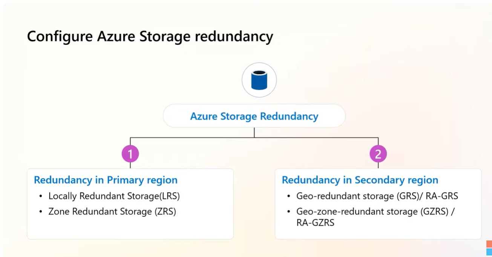
### Configure object replication
- Notes:
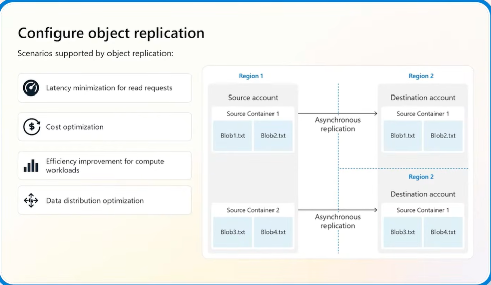
### Configure storage account encryption
- Notes:
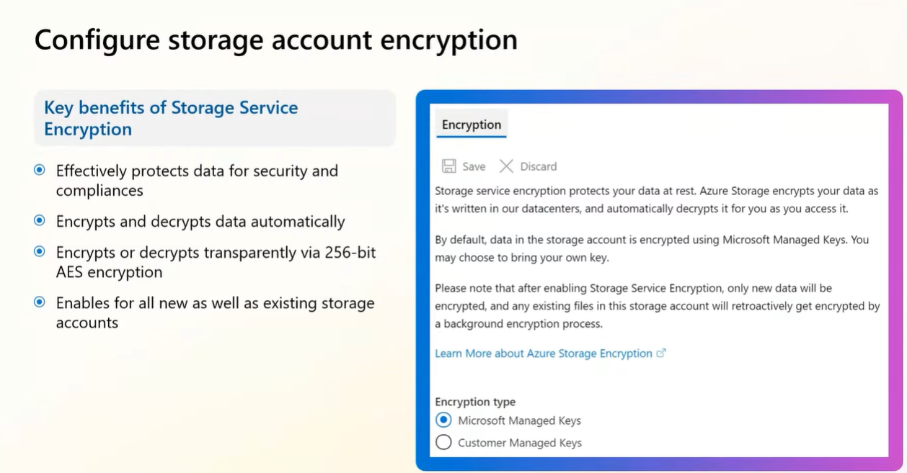
### Manage data by using Azure Storage Explorer and AzCopy
- Notes:
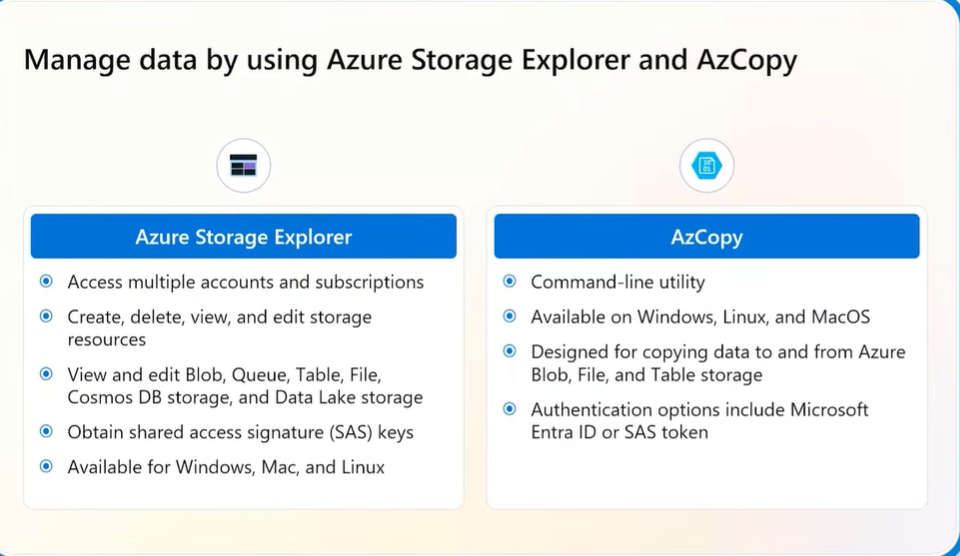
---
## 2.3 Configure Azure Files and Azure Blob Storage

### Create and configure a file share in Azure Files
- Notes:
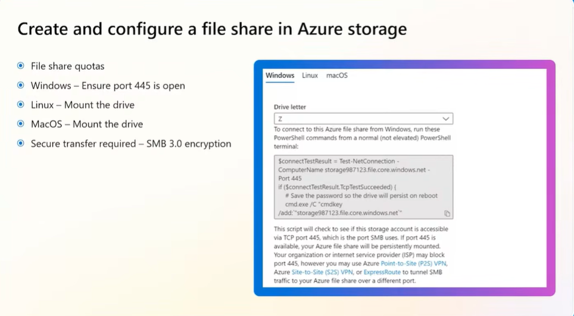

### Create and configure a container in Azure Blob Storage
- Notes:
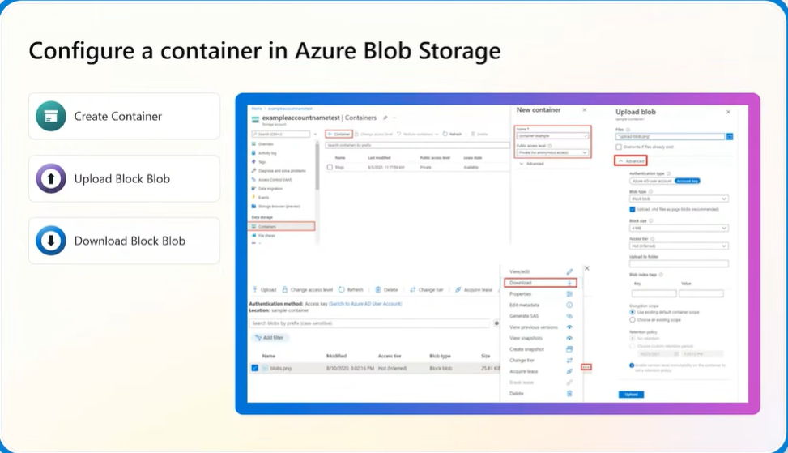
### Configure storage tiers
- Notes:
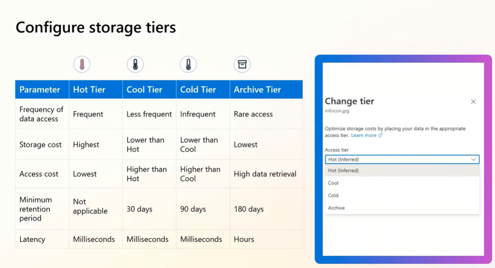
### Configure soft delete for blobs and containers
- Notes:

### Configure snapshots and soft delete for Azure Files
- Notes:
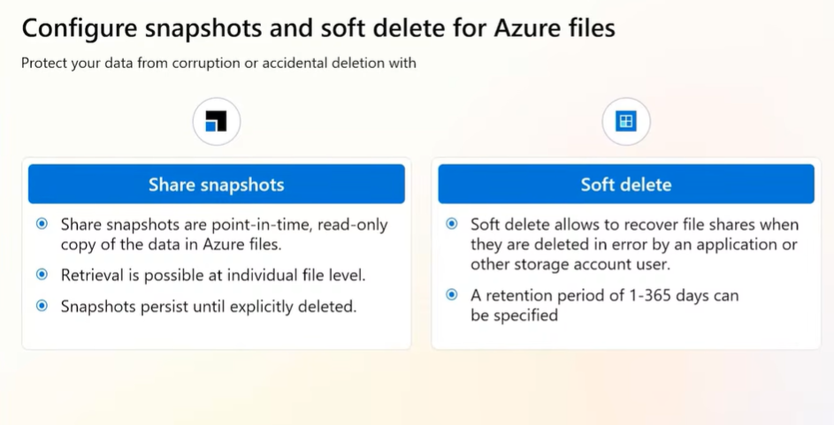
### Configure blob lifecycle management
- Notes:
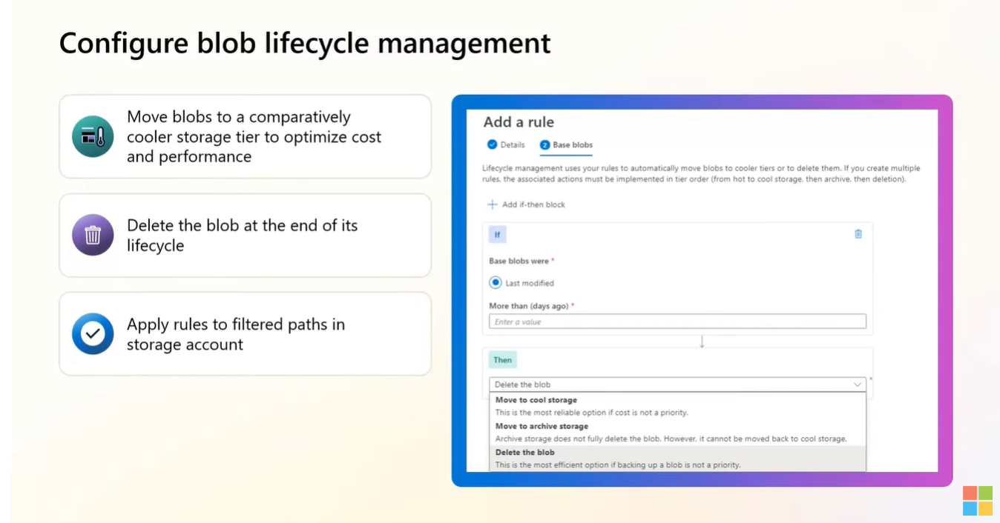
### Configure blob versioning
- Notes:
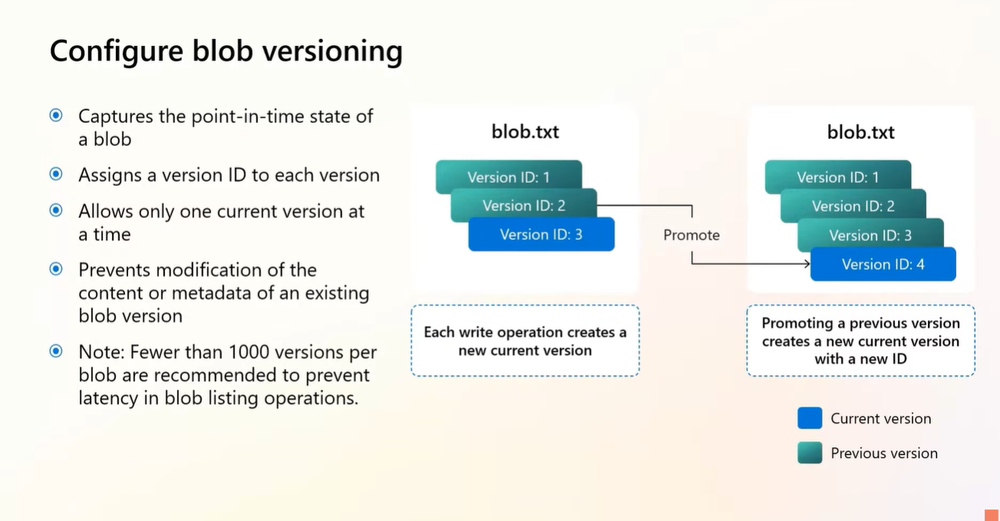
---

## 🔑 Key Takeaways
-

## ❓ Questions / Gaps to Revisit
-

## 🔗 Useful Links
-
