# 4. Implement and Manage Virtual Networking (15–20%)

> Status: 🔴 Not started | 🟡 In progress | 🟢 Done
> Last updated: <!-- date -->

---
---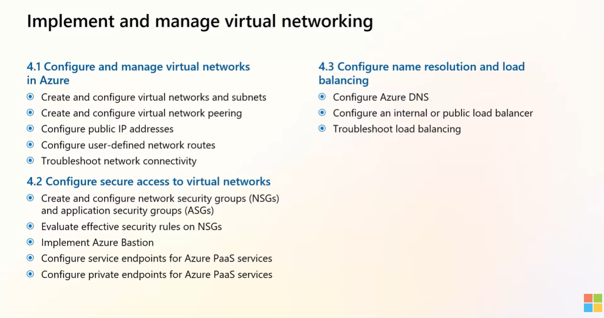

## 4.1 Configure and Manage Virtual Networks in Azure

### Create and configure virtual networks and subnets
- Notes:
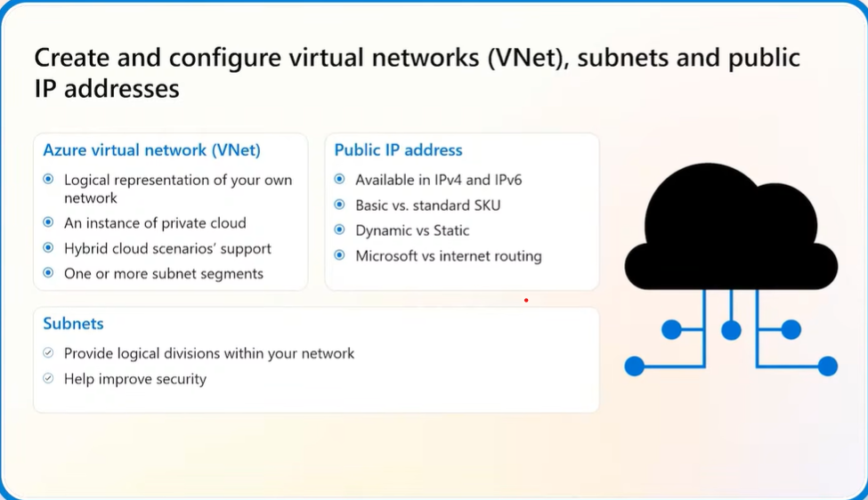
### Create and configure virtual network peering
- Notes:
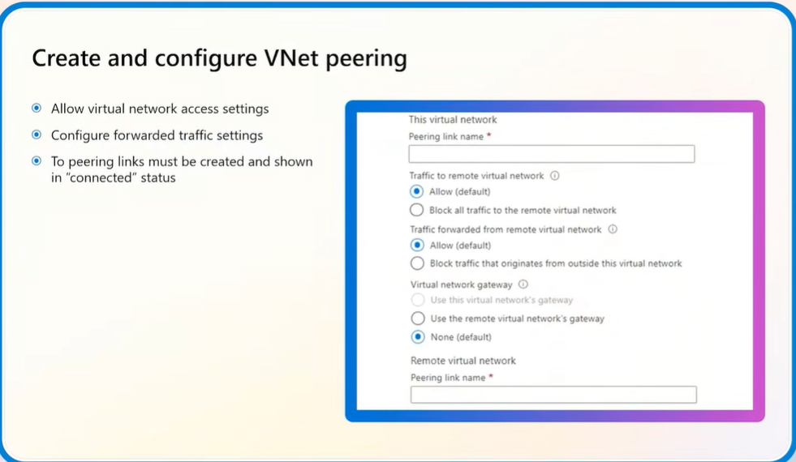
### Configure public IP addresses
- Notes:

### Configure user-defined routes
- Notes:
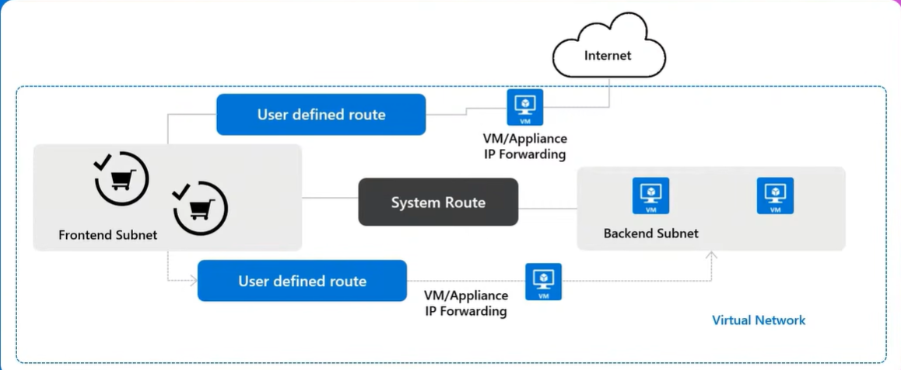
### Troubleshoot network connectivity
- Notes:
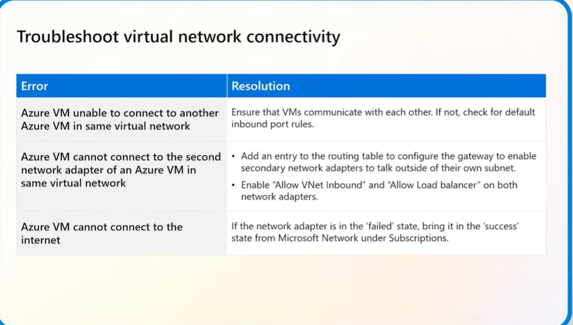
---

## 4.2 Configure Secure Access to Virtual Networks

### Create and configure network security groups (NSGs) and application security groups
- Notes:
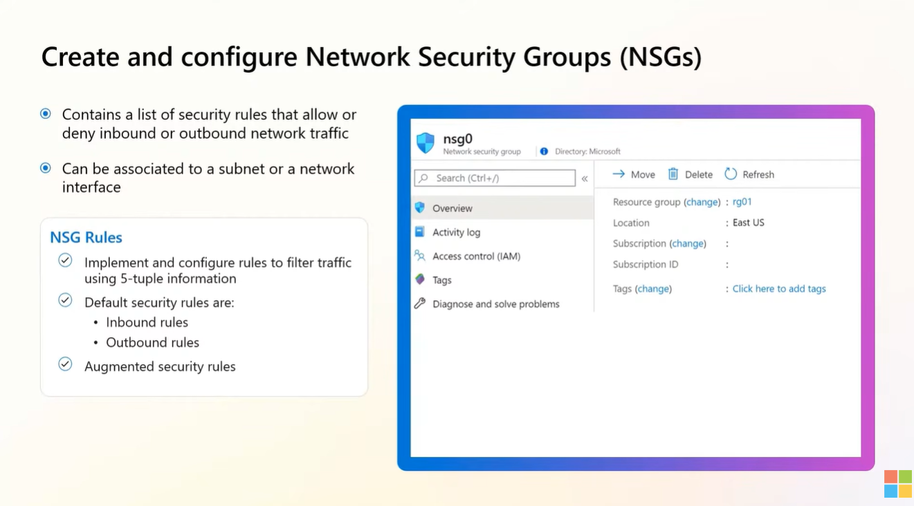
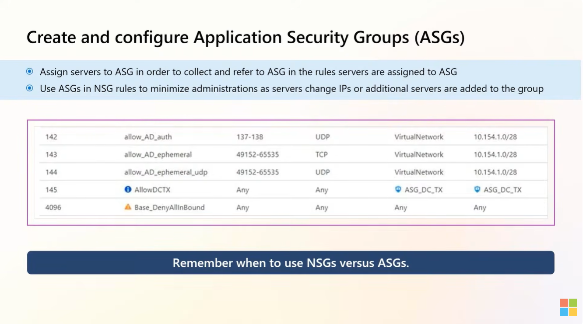
### Evaluate effective security rules in NSGs
- Notes:

### Implement Azure Bastion
- Notes:
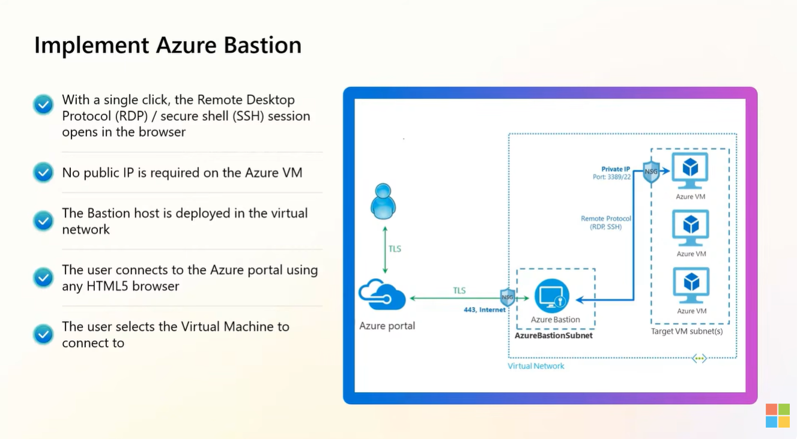
### Configure service endpoints for Azure PaaS
- Notes:

### Configure private endpoints for Azure PaaS
- Notes:
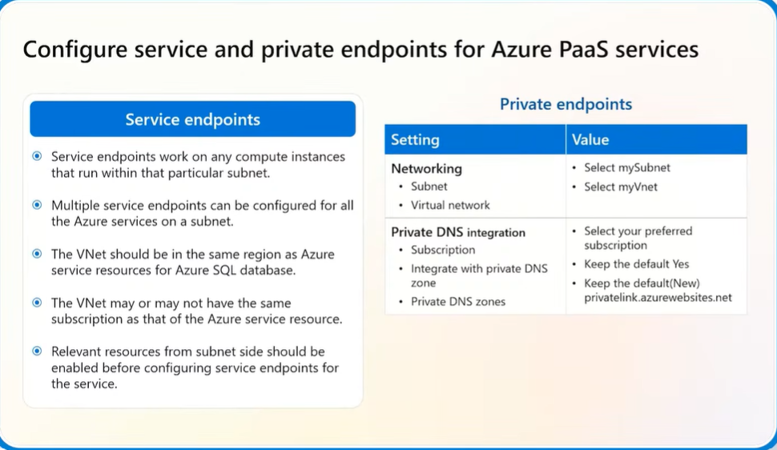
---

## 4.3 Configure Name Resolution and Load Balancing

### Configure Azure DNS
- Notes:
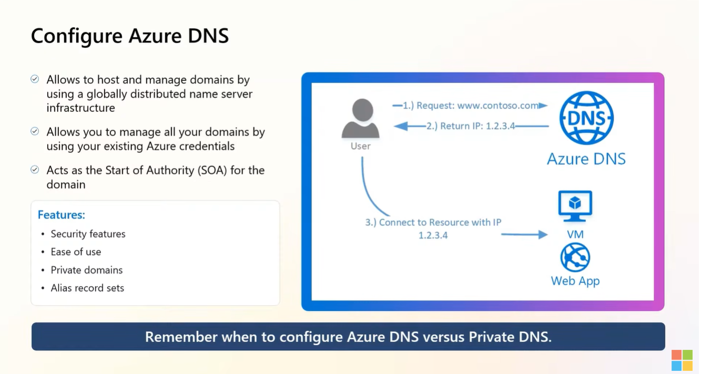
### Configure an internal or public load balancer
- Notes:
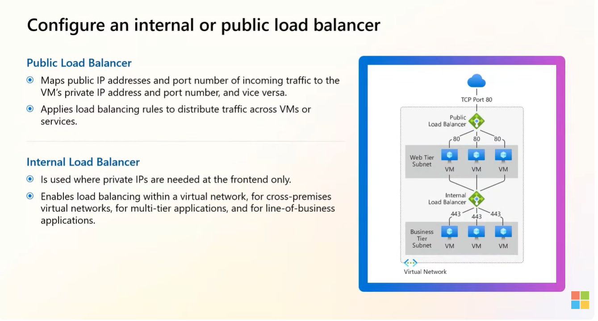
### Troubleshoot load balancing
- Notes:
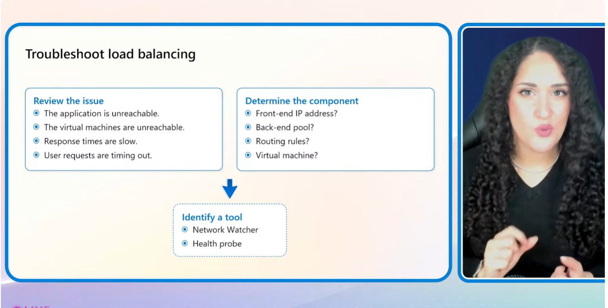
---

## 🔑 Key Takeaways
-

## ❓ Questions / Gaps to Revisit
-

## 🔗 Useful Links
-
