# 5. Monitor and Maintain Azure Resources (10–15%)

> Status: 🔴 Not started | 🟡 In progress | 🟢 Done
> Last updated: <!-- date -->

---

## 5.1 Monitor Resources in Azure
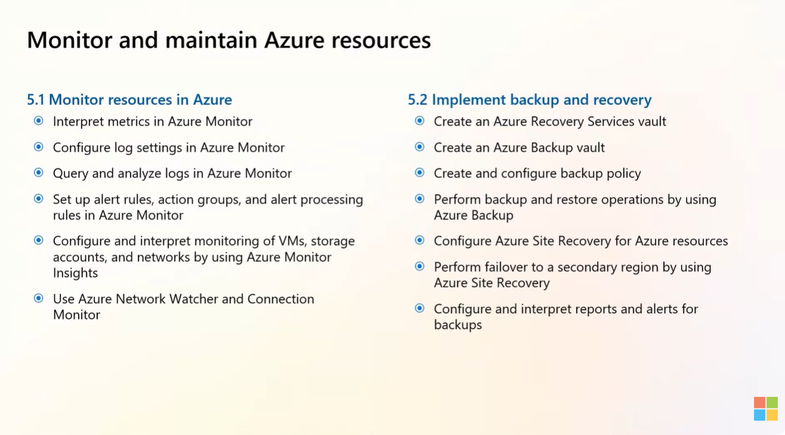
### Interpret metrics in Azure Monitor
- Notes:
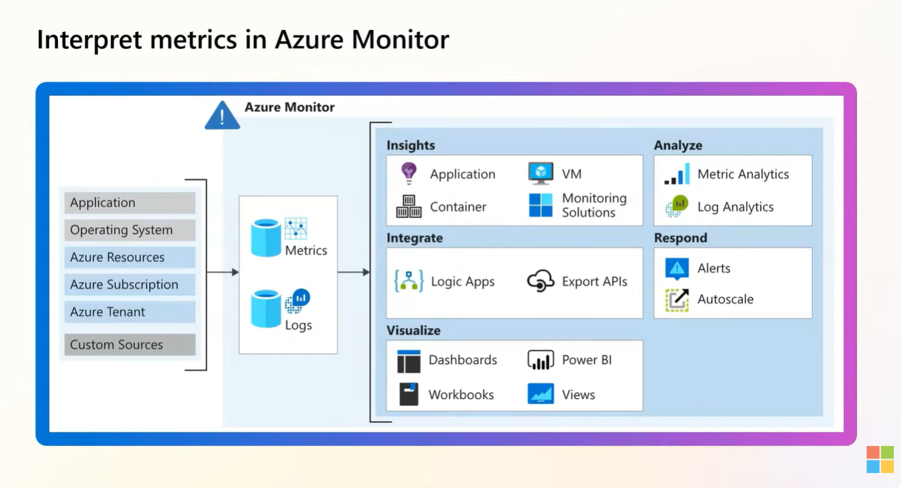
### Configure log settings in Azure Monitor
- Notes:
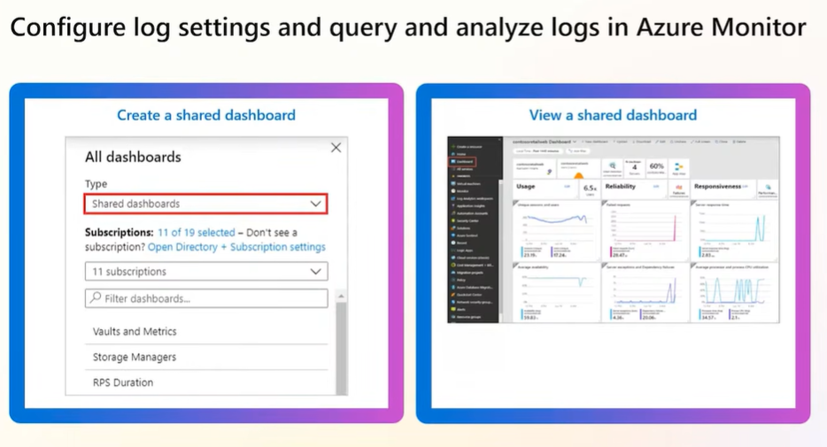
### Query and analyze logs in Azure Monitor
- Notes:

### Set up alert rules, action groups, and alert processing rules in Azure Monitor
- Notes:
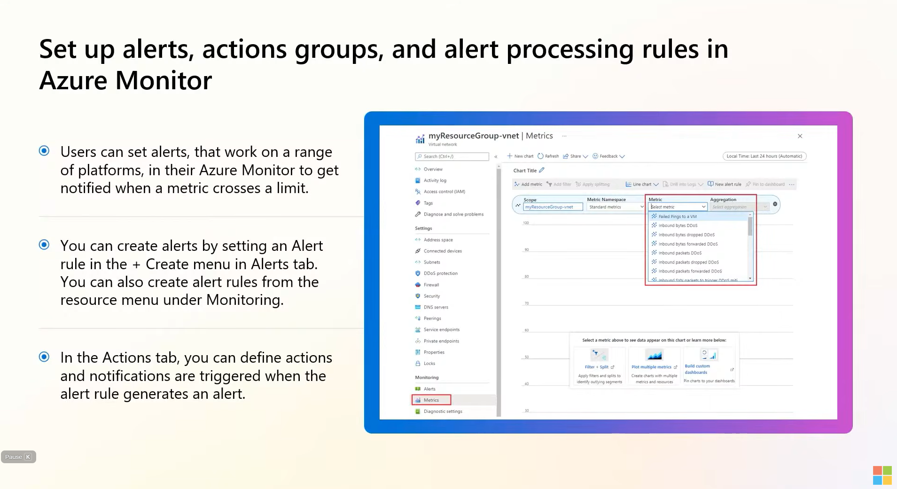
### Configure and interpret monitoring of VMs, storage accounts, and networks using Azure Monitor Insights
- Notes:
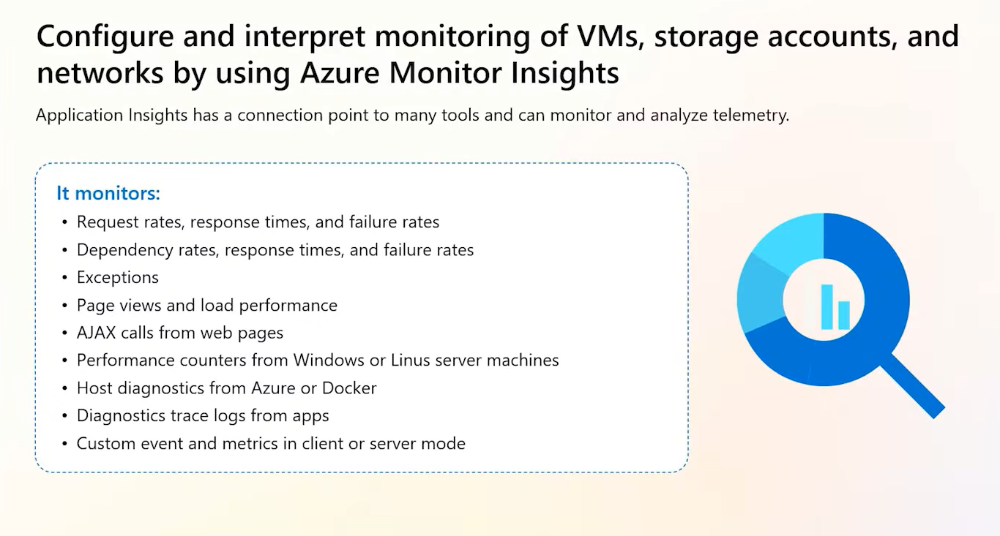
### Use Azure Network Watcher and Connection Monitor
- Notes:
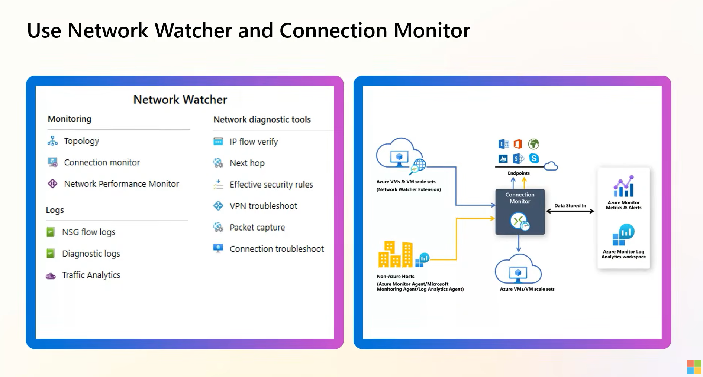
---

## 5.2 Implement Backup and Recovery

### Create a Recovery Services vault
- Notes:
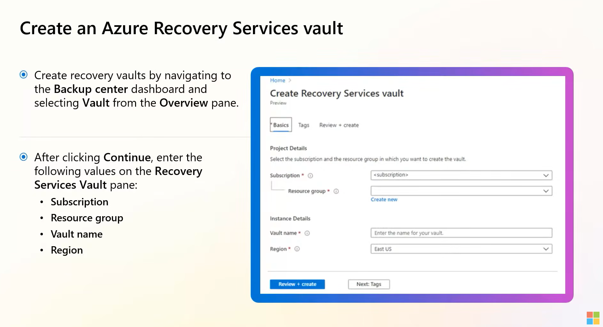
### Create an Azure Backup vault
- Notes:
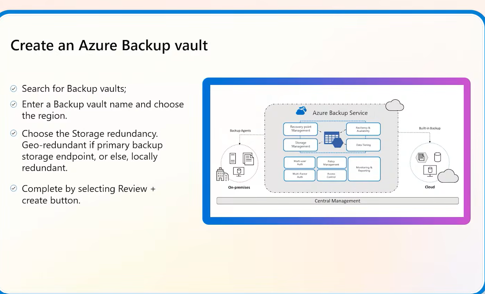
### Create and configure a backup policy
- Notes:
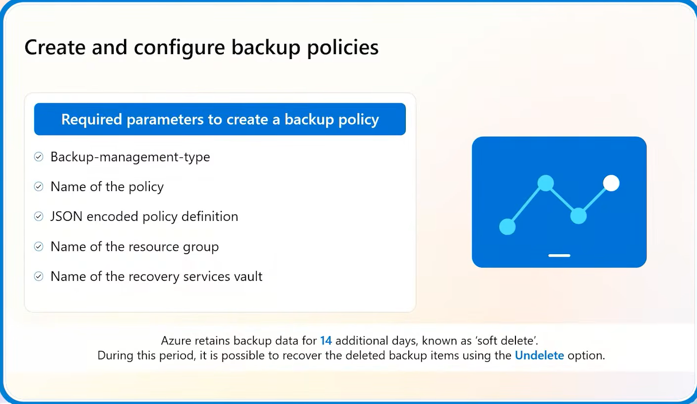
### Perform backup and restore operations by using Azure Backup
- Notes:
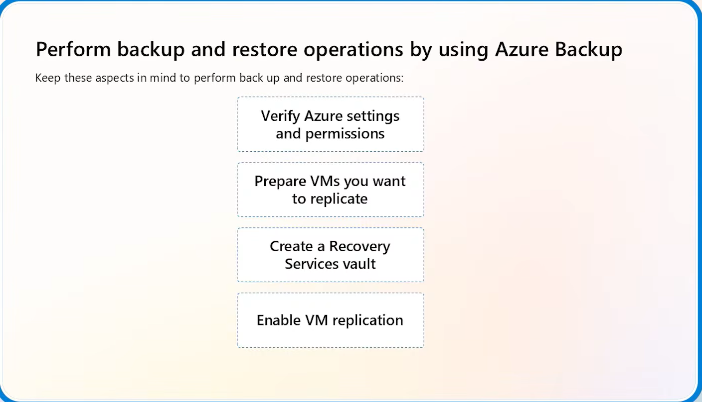
### Configure Azure Site Recovery for Azure resources
- Notes:

### Perform a failover to a secondary region by using Site Recovery
- Notes: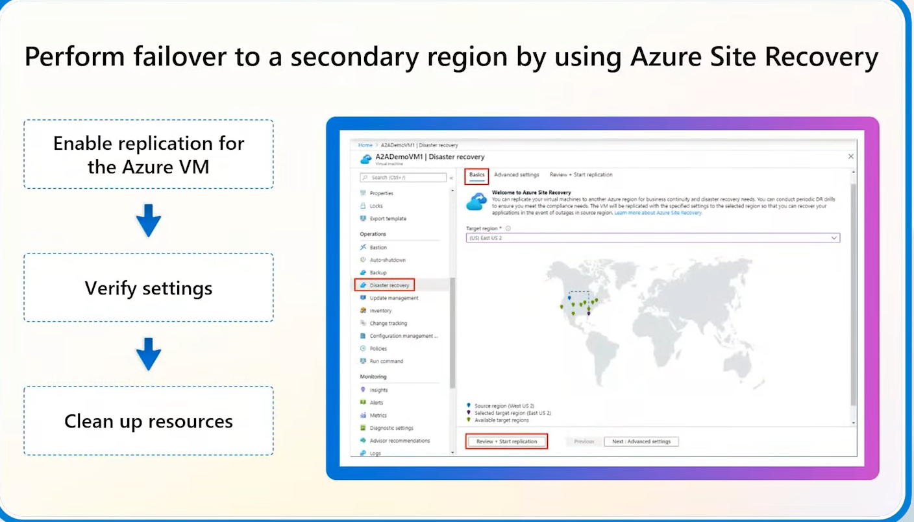

### Configure and interpret reports and alerts for backups
- Notes:

---

## 🔑 Key Takeaways
-

## ❓ Questions / Gaps to Revisit
-

## 🔗 Useful Links
-
