Option B 

Option A

option B

option A and D

Option B

Option C

option A

option B

option A

Option B

make ,blob

option D

option A

Option D
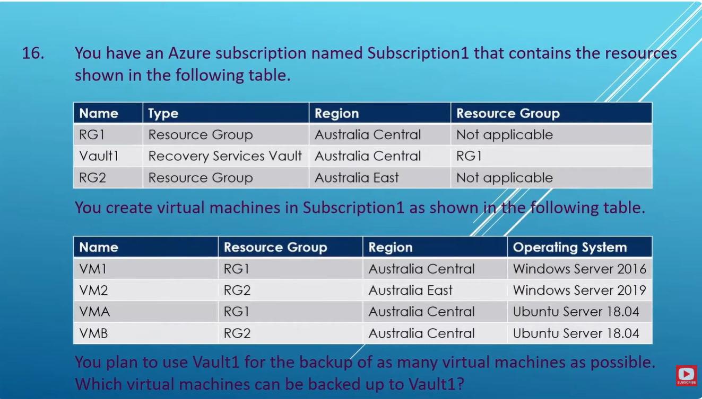

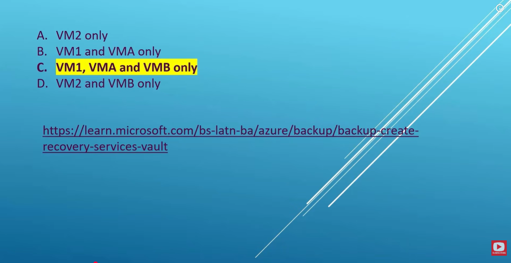
option A
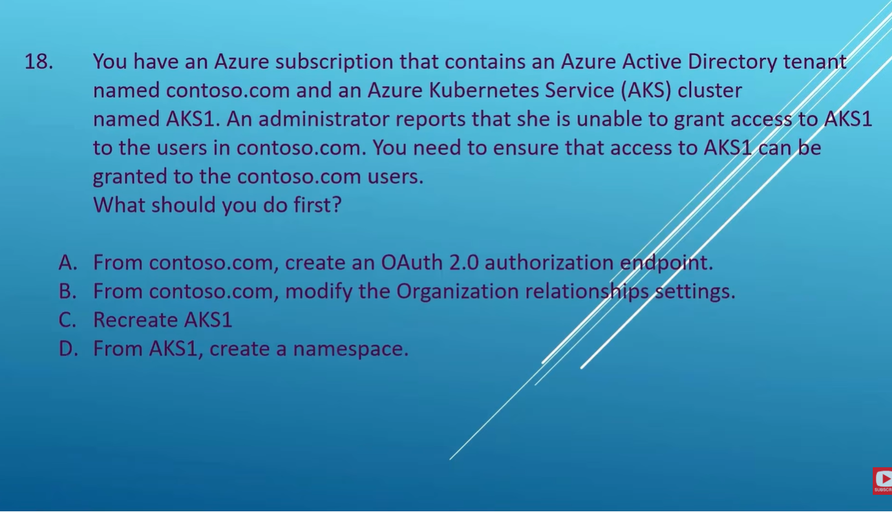
Option A
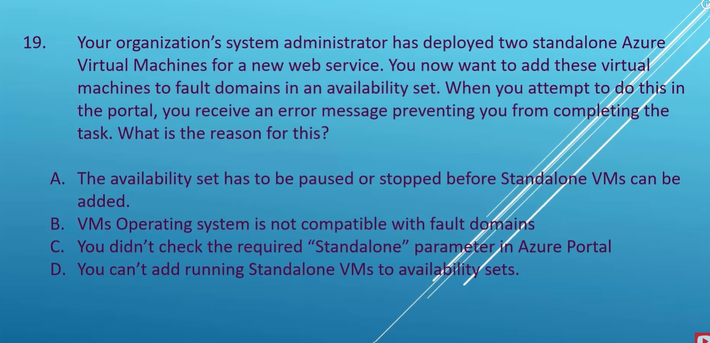
Option D
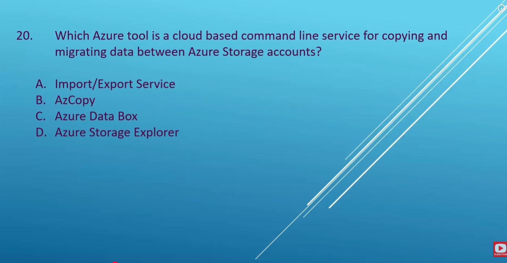
option B

Option D
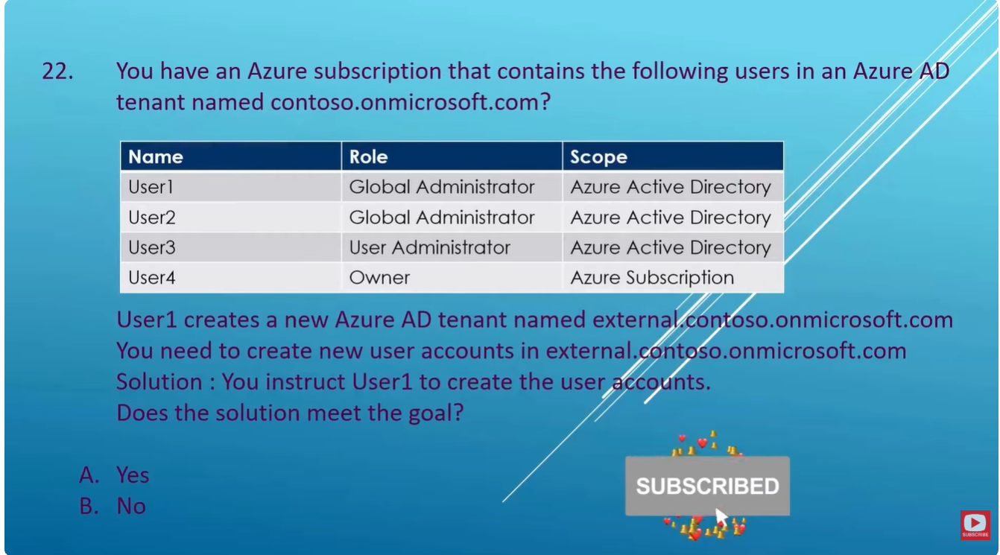
option A
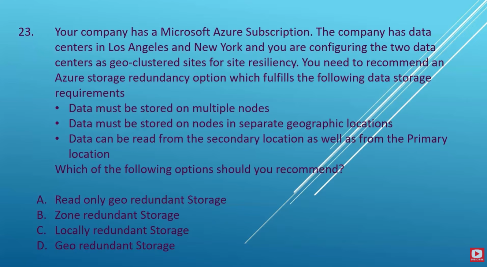
Option A
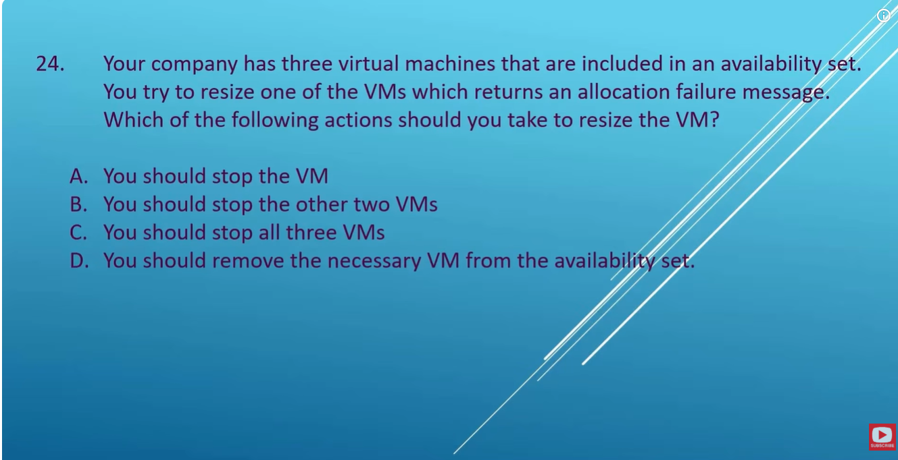
not sure
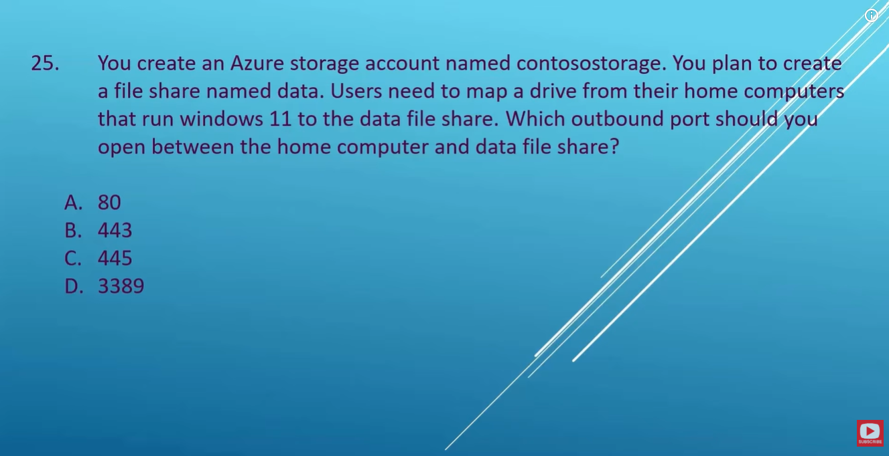
option C
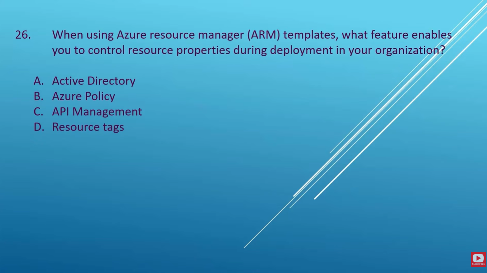
option B 
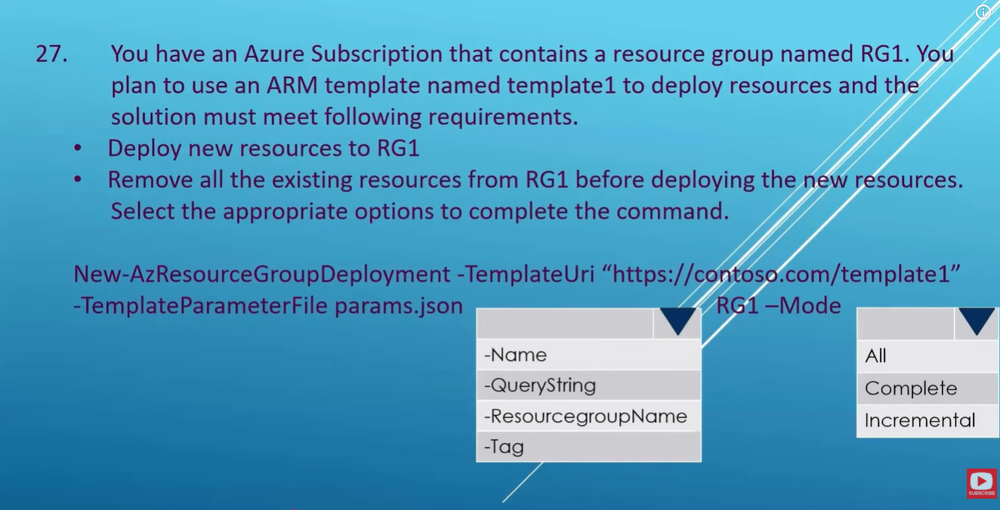
ResourceGroup Name and Complete
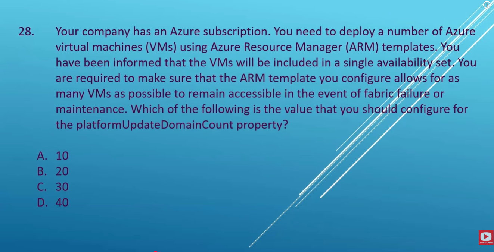
notsure
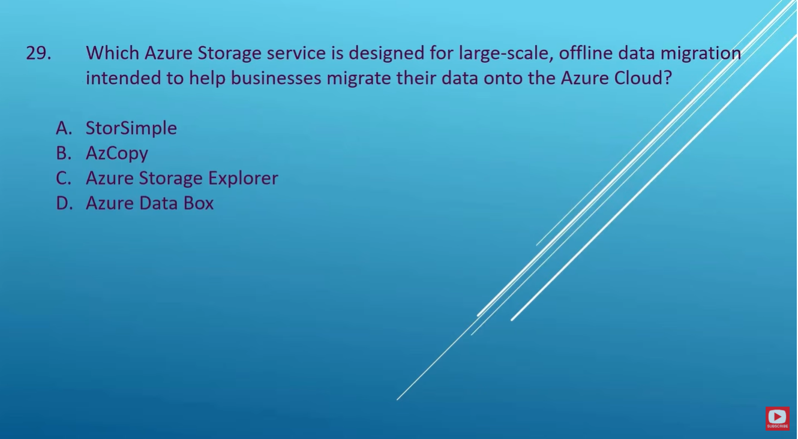
option D

Option C.

